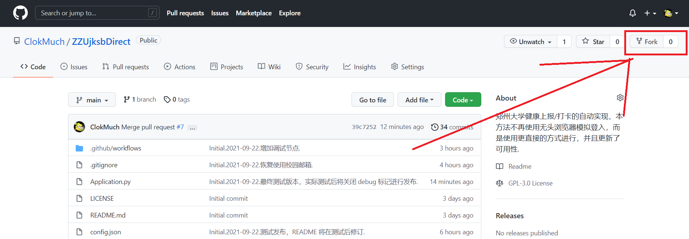
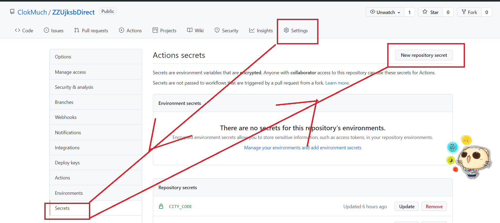
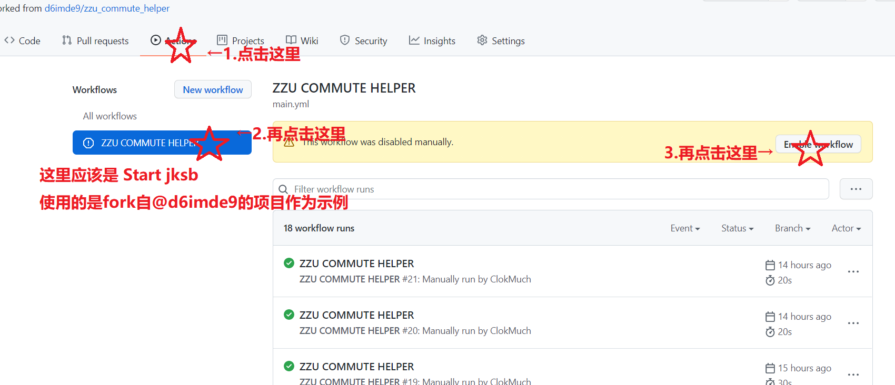

# ZZUjksbDirect
关键词： **健康打卡 郑州大学 健康上报 jksb zzu**

郑州大学健康上报/打卡的自动实现，本方法不再使用无头浏览器模拟登入，而是使用更直接的方式进行，并且更新了可用性.

## 计划开发中的功能：多用户支持（包括邮件通知打卡结果）.

# 使用说明

## 简述
+ 每日4次定时打卡：3时21分、6时21分、8时21分、9时21分，建议自行错开分钟时间，避免服务器拥堵导致打卡失败；
+ 所有关键的隐私信息使用 Secrets 保存（只有您一个人知道，除非您开启调试并泄露结果通知邮件），非隐私项目需要自行配置 config.json 设置；
+ 支持打卡失败时邮件提醒（需要自行配制邮件信息，建议使用学校的邮件系统）；
+ 项目60天无更新时，自动执行可能会失效，需要再次开启（无需再次配置 Secrets 等）；

## 灵感
+ 感谢项目 [d6imde9/zzu_commute_helper](https://github.com/d6imde9/zzu_commute_helper) 提供使用 Action 自动执行的灵感，鼓励前往d6imde9的项目处观星.

+ **请注意：本项目没有提供多人打卡的支持，但将城市和地理位置设为隐私信息，增加了设置的难度，具体的配置过程与其相似，如遇到无法加载图片，您可以访问上述项目，参考配置 :D**

## 开箱即用的操作指南
**建议使用电脑进行操作**

### 1. 移植仓库到您的账号 
* 在本项目右上角处，点击 fork （注意不要点到数字）（也可以点击 star 成为观星者/天文学家 stargazer）

### 2. 配置您的隐私信息：学号、密码、地址等

* 点击项目的`Settings`-->`Secrets`-->`New repository secret`，准备新建 Secrets；
* 增加学号：在 Name 中输入 `user_id` ，在 Value 中输入您的学号，一般为连续的12位数字；
* 增加密码：在 Name 中输入 `user_pd` ，在 Value 中输入您的密码，一般与登录查询成绩、健康上报打卡的密码一致；
* 增加省市：Name 输入 `city_code` , Value 输入您身份证号码**前4位**；
* 增加具体位置：Name 输入 `location` ，Value 输入您的具体位置；
* 增加发送邮箱的邮箱名：Name 输入`mail_id`，Value 输入您准备好发送消息邮箱，如果您使用学校邮箱输入即可，类似于：`polar10249620@stu.zzu.edu.cn` **注意：这是一个举例，并非真实的邮箱，如果您直接输入此邮箱，您将接收到错误信息**；
* 增加发送邮箱的邮箱密码：Name 输入 `mail_pd`，Value 输入邮箱密码；
* 增加接收失败消息的邮箱：Name 输入 `mail_target`， Value 输入您接受异常消息的邮箱，您可以使用您的QQ邮箱作为接收消息的邮箱；
* 增加您的真实姓名：Name 输入 `real_name`，Value 输入您的真实姓名，这样的话如果非调试模式下，返回消息含有您的姓名，会被替换为 `喵喵喵`，如果您不输入这对 Secret ，程序的运行可能会报错（手动滑稽~被迫喵喵喵 😺

### 3. 启用 Action ，开启定时打卡

* 按图片指示顺序点击；
* 随后点击`Run workflow`，运行一次 Action 测试效果.

### 4. 备用：项目更新方法
**建议使用 @d6imde9 提到的 删库-重建 更新法**

若您有一定的高级技巧，为您提供更简便的思路：同步上游更改、创建PR、合并PR、删除分支

另一种方法：项目一般将只修改 config.json 文件，您可以直接复制上游的文件并提交 commit .

# 结束
* **再次感谢项目 [d6imde9/zzu_commute_helper](https://github.com/d6imde9/zzu_commute_helper) 提供的 Actions 技巧；**
* 如有异常问题，您可以将失败的邮件转发给我，我**不一定**会帮助您处理异常；
* 如您喜欢全球最大的同性交友网站，您可以尝试创建 Issue 来描述您的问题，**请注意不要泄露您的反馈邮件**；
* 也欢迎您通过电邮联系我 1831158739@qq.com （此 QQ 无法添加好友，但您可以直接发送电邮）；
* 本项目随时可能会删库跑路 ╰(°▽°)╯
